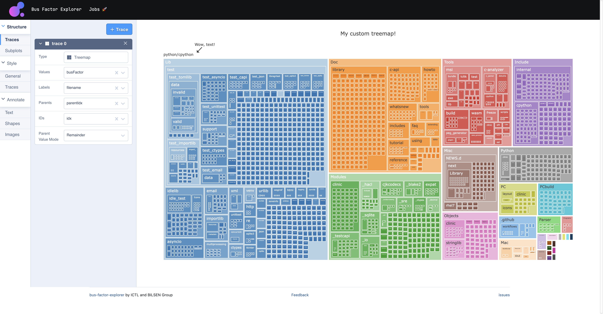
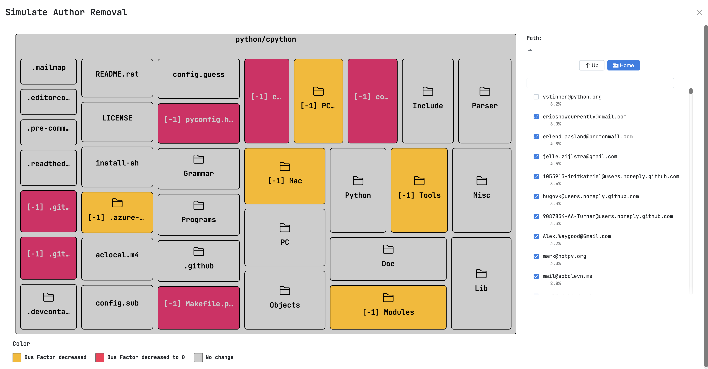

[](https://confluence.jetbrains.com/display/ALL/JetBrains+on+GitHub)
[](https://github.com/JetBrains-Research/bus-factor-explorer/actions/workflows/ci.yml)
# `bus-factor-explorer`
A web app for exploring Bus Factor of GitHub projects.

## About
Bus factor (BF) is a metric that tracks knowledge distribution in a project.
It is the minimal number of engineers that have to leave for a project to stall.
`bus-factor-explorer` provides an interface and an API to compute, export, 
and explore the Bus Factor metric via treemap visualization, turnover simulation mode, and interactive charts.
It supports repositories hosted on GitHub and enables functionality to search repositories and process multiple repositories 
at the same time.

Our tool enables the users to identify the files and subsystems at risk of stalling in the event of developer turnover 
by analyzing the commit history.

Demo is available on [YouTube](https://youtu.be/uIoV79N14z8).

## Quick start
Docker:
```shell
docker run -p 8080:8080 -it ghcr.io/jetbrains-research/bus-factor-explorer/bus-factor-explorer:latest
```
Docker Compose configuration is also [available](docker-compose.yml) in the repository.

## Usage
Simple scenario:
1. Open the main page;
2. Search for a repository. Tou can use [advanced GitHub search](https://docs.github.com/en/search-github/searching-on-github/searching-for-repositories) syntax; 
3. Click on the repository and wait for the calculation to finish;
4. Reload the main page and click on the repository in the main page;
5. Explore bus factor data using built-in visualization, or process the results externally using `Explore Data` panel.

## Screenshots




## Evaluation
To evaluate our tool, we computed the bus factor of 935 popular repositories on GitHub.
The results are available in the `evaluation` directory.

#### Local development
Build and start:
1. Run `./gradlew jibDockerBuild`
2. Run `docker compose up`

Auto-format code:
1. Run `./gradlew ktlintFormat`
